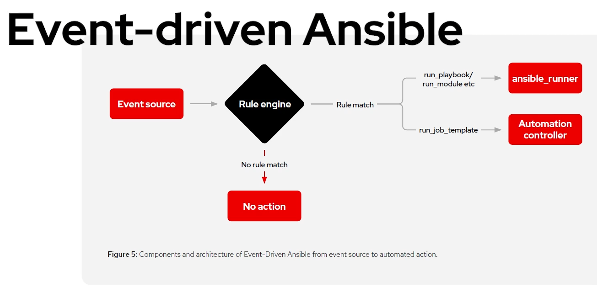
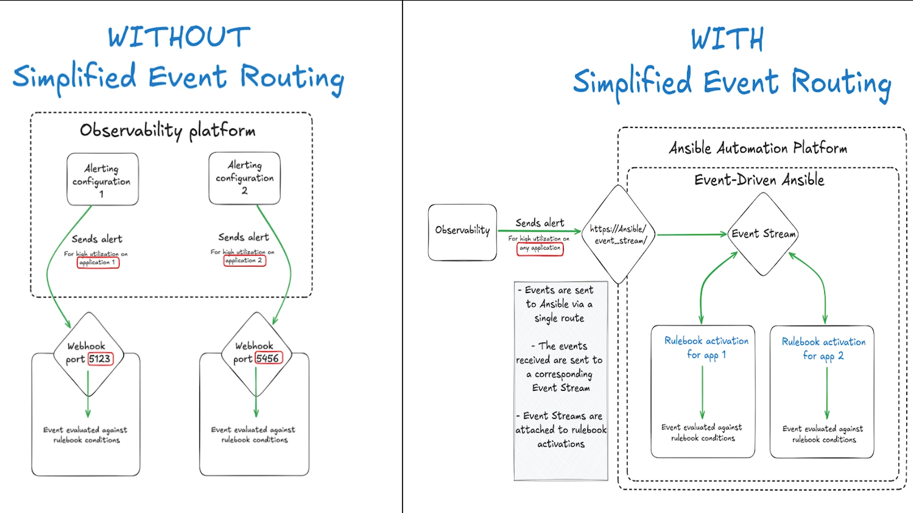

# Red Hat Ansible Automation Platform (AAP)

**Ansible Automation Platform (AAP)** is Red Hat’s enterprise-grade automation solution. It provides a web-based UI, REST API, RBAC, job scheduling, and certified content, enabling teams to automate IT infrastructure at scale.

---

## 🔐 Role-Based Access Control (RBAC)

AAP enables fine-grained **RBAC** to control access to automation resources based on **user roles** and **team membership**.

### Key RBAC Concepts

| Entity           | Description                                                               |
| ---------------- | ------------------------------------------------------------------------- |
| **Organization** | Logical grouping of users, teams, inventories, projects, and credentials. |
| **Team**         | Group of users with shared access and roles within an organization.       |
| **User**         | Individual login account with assigned roles or team memberships.         |

### Common Roles

| Role      | Permissions                                  |
| --------- | -------------------------------------------- |
| Admin     | Full access to resources in the organization |
| Execute   | Can run job templates                        |
| Read-Only | Can view but not modify resources            |
| Auditor   | Can view logs, job runs, and configurations  |

> ✅ Assign roles at the **organization**, **team**, or **resource level** (e.g., job templates, inventories).

---

## 🧩 Job Templates

**Job Templates** define reusable automation jobs using a playbook and inventory.

### 🔧 Components of a Job Template:

* Playbook
* Inventory
* Credentials (SSH, Vault, etc.)
* Extra variables
* Verbosity level
* Job tags / Skip tags

Example: Run an Apache installation playbook using a job template.

---

## 🔄 Workflows

A **Workflow** in AAP links multiple job templates and decisions into a **visual automation pipeline**.

### Workflow Visualizer

* Drag-and-drop interface to build automation sequences
* Use logic gates (success, failure, always)
* Supports branching and conditional execution

Example Use Case:

```text
Provision → Configure → Run Security Scan → Notify Teams → Clean up
```

---

## ⚡ Event-Driven Ansible (EDA)

**Event-Driven Ansible** introduces reactive automation using **events** as triggers to run Ansible actions in real time.

### Key Concepts

| Component        | Description                                                          |
| ---------------- | -------------------------------------------------------------------- |
| **Rulebook**     | Defines rules for matching incoming events and corresponding actions |
| **Source**       | Event input source (e.g., webhook, Kafka, log, SNMP, Prometheus)     |
| **Action**       | What Ansible should do (run a playbook, set facts, log, etc.)        |
| **Event Stream** | Real-time feed of events consumed by Ansible rulebooks               |

### Sample Rulebook

```yaml
---
sources:
  - name: webhook
    type: ansible.eda.webhook

rules:
  - name: Restart Apache on HTTP 500
    condition: event.payload.status == "500"
    action:
      run_playbook:
        name: restart_apache.yml
```

> Event-Driven Ansible is ideal for **auto-remediation**, **real-time monitoring**, **security automation**, and **incident response**.





---

## Organizational Hierarchy in AAP

```text
Ansible Automation Platform
├── Organization (e.g., DevOps)
│   ├── Users (Alice, Bob)
│   ├── Teams (WebOps, SecurityOps)
│   ├── Inventories, Credentials, Projects
│   ├── Job Templates & Workflows
```

---

## Summary

| Feature           | Purpose                                          |
| ----------------- | ------------------------------------------------ |
| **RBAC**          | Secure and manage access to automation resources |
| **Organizations** | Logical grouping of automation assets            |
| **Teams/Users**   | Define roles and responsibilities                |
| **Job Templates** | Reusable automation jobs with parameterization   |
| **Workflows**     | Visual and logical automation pipelines          |
| **EDA**           | Real-time, event-triggered automation            |

---

## Author

Abhishek Rajput
