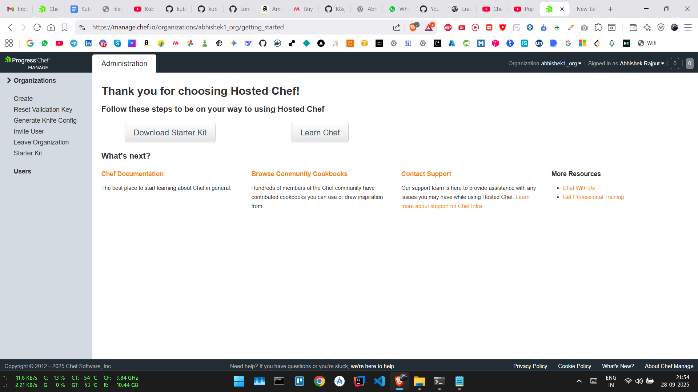

# 🍳 Chef Workstation Setup and Cookbook Management

This guide explains how to install **Chef Workstation** on Ubuntu/WSL, connect to a Chef Server, create and upload cookbooks, and bootstrap a node.

---

## 🚀 1. Install Chef Workstation

```bash
sudo apt update -y
sudo apt install -y curl wget gnupg2 lsb-release software-properties-common
```

Download the Chef Workstation package:

```bash
wget https://packages.chef.io/files/stable/chef-workstation/24.12.1073/ubuntu/20.04/chef-workstation_24.12.1073-1_amd64.deb
```

Install it:

```bash
sudo dpkg -i chef-workstation_24.12.1073-1_amd64.deb
sudo apt install -f -y
```

Check installation:

```bash
chef --version
```

Cleanup installer:

```bash
rm chef-workstation_24.12.1073-1_amd64.deb
```
### Uninstall Chef Workstation

1. Remove the Chef Workstation package

```bash
sudo dpkg -r chef-workstation
```

If there are broken dependencies after removal, fix them:

```bash
sudo apt install -f -y
```

---

2. Remove residual files

```bash
sudo rm -rf /opt/chef-workstation
sudo rm -rf ~/.chef
```

---

3. Optional: Remove the Chef cache

```bash
sudo rm -rf /var/chef
sudo rm -rf /var/chef/cache
```

---

4. Verify uninstall

```bash
chef --version
```

This should return **command not found** if Chef has been successfully removed.


---

## 🌐 2. Connect to Chef Server

Sign in to [Chef Manage](https://manage.chef.io/) and download the **Starter Kit**.



Unzip the starter kit in your working directory:

```bash
sudo apt install -y unzip
unzip chef-starter.zip
```

Command to upload file from PC to GCP:
```bash
gcloud compute scp "FILE_LOCATION" USERNAME@INSTANCE_NAME:/home/USERNAME/ --zone=ZONE_NAME
```
`Example: gcloud compute scp "C:\Users\abhis\Downloads\chef-starter.zip" abhishek25022004@instance-20250929-080208:/home/abhishek25022004/ --zone=us-central1-c`

This creates a `.chef` folder with your configuration and credentials.

---

## 🗂 3. Example Directory Structure

After extracting the starter kit, your project might look like this:

### Chef Starter Kit Structure

```
project/
├── .chef/
│   ├── config.rb
│   └── username.pem
├── cookbooks/
│   ├── chefignore
│   └── starter/
│       ├── attributes/
│       │   └── default.rb
│       ├── files/
│       │   └── default/
│       │       └── sample.txt
│       ├── metadata.rb
│       ├── recipes/
│       │   └── default.rb
│       └── templates/
│           └── default/
│               └── sample.erb
├── roles/
│   └── starter.rb
├── README.md
└── .gitignore

```

⚠️ Make sure to update the*cookbook_path* in *.chef/config.rb* to *["#{current_dir}/../../cookbooks"]*

---

## 📦 4. Create a Cookbook

Generate a new cookbook:

```bash
chef generate cookbook cookbook_name
```

--- 

## 🗂 5. Example Directory Structure

After creating the cookbooks, your project might look like this:


### Cookbooks Directory Example

```
cookbook_name/
├── CHANGELOG.md
├── LICENSE
├── Policyfile.rb
├── README.md
├── chefignore
├── compliance/
│   ├── README.md
│   ├── inputs/
│   ├── profiles/
│   └── waivers/
├── kitchen.yml
├── metadata.rb
├── recipes/
│   └── default.rb
└── test/
    └── integration/
        └── default/
            └── default_test.rb

```


### Update recipes/default.rb
```bash
# Cookbook:: 1_sample
# Recipe:: default
#
# Copyright:: 2025, The Authors, All Rights Reserved.

package 'httpd'
service 'httpd' do
action [:enable, :start]
end

file '/var/www/html/index.html' do
content 'Welcome! You have successfully configured your node'
end
```

---

## NOTE: Now execute commands while inside chef-repo directory 
`Example: /AbhishekLinux/DevOps/chef_basic/chef-repo/`

## 📦 6. Upload a Cookbook

Upload a cookbook to the server while inside chef-repo directory:


```bash
knife cookbook upload cookbook_name
```

Or specify the cookbook path:

```bash
knife cookbook upload 1_sample --cookbook-path ~/AbhishekLinux/DevOps/chef_basic/cookbooks
```

## 👥 7. Manage Users and Clients

List all users:

```bash
knife user list
```

List all clients:

```bash
knife client list
```

---

## 🖥️ 8. Bootstrap a Node


1. Get IP of the **node**:

```bash
ip a
```
`Example: 192.168.2.190`

2. Bootstrap the node:

```bash
knife bootstrap 192.168.2.190 --ssh-user root --ssh-password 1234 --node-name chef_node
```

3. Run the Chef client:

```bash
chef-client
```

---

## 🌍 9. Access Locally

Now you can see a new node at [Chef Manage](https://manage.chef.io/). Add Cookbook from [Chef Manage](https://manage.chef.io/) to that node and run the Cookbook.

Once done, you can access services running on the node via:

```
http://localhost
```

---

## ✅ Summary

* Installed **Chef Workstation** on Ubuntu/WSL.
* Connected to **Chef Server** using the starter kit.
* Generated and uploaded cookbooks.
* Bootstrapped a remote node.
* Managed cookbooks, users, and clients with `knife`.
* Maintained a clean, organized directory structure.


## Author
 - Abhishek Rajput
 - Chef Username abhishek25022004@gmail.com: abhishek-2502
 - Chef Username rajput25022004@gmail.com: rajput25


